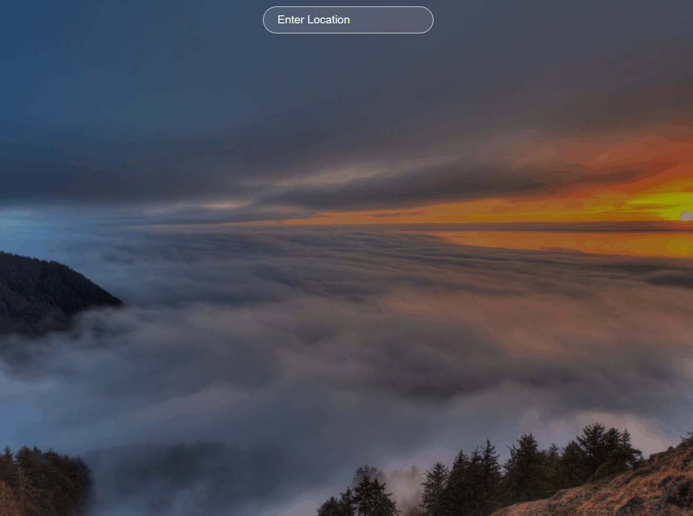

# Weather-App
* [GIF](#GIF)
* [GO TO THE WEBSITE](#GO-TO-THE-WEBSITE)
* [HOW TO USE](#HOW-TO-USE)

# GIF

# HOW TO USE

WRITE LOCATION AND PRESS ENTER.

 
 

# GO TO THE WEBSITE
<a href="https://papaya-baklava-0561c1.netlify.app/">WEATHER APP</a>

